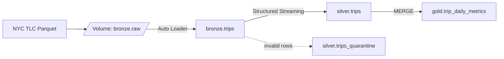

# Databricks Lakehouse — NYC Taxi (mobility domain)

An end-to-end batch/streaming lakehouse on Azure Databricks, built CLI-first and
promoted across three environments through a full CI/CD pipeline. It ingests NYC
Taxi trip data through a medallion architecture (bronze → silver → gold),
governed by Unity Catalog and packaged as a Declarative Automation Bundle.

## Architecture

A Lakeflow Job orchestrates the layers (`setup → bronze → silver → gold`) on a
daily schedule, deployed identically to `dev`, `stg`, and `prod`.

## Data flow

- **Bronze** — Auto Loader incrementally ingests raw Parquet with full fidelity,
  adding ingestion metadata (`file_name`, `ingestion_time`). Incremental and
  idempotent: re-runs process only new files.
- **Silver** — Structured Streaming cleans and standardizes columns
  (snake_case), then splits rows: valid rows to `silver.trips`, invalid rows to
  `silver.trips_quarantine` with a `quarantine_reason` (six rules, including
  temporal-range validation derived from the source file name).
- **Gold** — Batch aggregation to daily revenue and trip volume, upserted via
  `MERGE` for idempotent recomputation.

## Namespace model

Three-level Unity Catalog namespace, chosen for domain isolation and layer-level
governance (see [ADR-0002](docs/adr/0002-lakehouse-namespace-modeling.md)):

| Level | Meaning | Example |
|---|---|---|
| catalog | `<domain>_<environment>` | `mobility_prod` |
| schema | medallion layer | `bronze`, `silver`, `gold` |
| table | entity | `trips`, `trip_daily_metrics` |

## Engineering

- **Packaging** — code is a Python wheel exposing entry points per stage; the
  bundle builds and deploys it.
- **Configuration** — the catalog is a bundle variable injected per target;
  identities and environment values are injected at deploy time via environment
  variables, never committed.
- **Orchestration** — Lakeflow Job with task dependencies and a daily schedule
  (`America/Sao_Paulo`). Chosen over Airflow for intra-platform orchestration
  (see [ADR-0001](docs/adr/0001-lakeflow-jobs-over-airflow.md)).
- **Testing** — transformation logic is extracted into pure functions and
  covered by unit tests (local PySpark), which gate every pull request.
- **CI/CD** — GitHub Actions with Git Flow: `feature → develop → homolog → main`,
  each environment deployed on merge to its branch. Production runs under a
  service principal and requires manual approval.

## Stack

Azure Databricks · Unity Catalog · Delta Lake · Auto Loader · Structured
Streaming · Lakeflow Jobs · Declarative Automation Bundles · PySpark · uv ·
GitHub Actions.

## Trial limitations

Some production practices are demonstrated in code but constrained by the Azure
Databricks trial: the three environments share a single workspace (isolated by
`<domain>_<environment>` catalogs rather than separate workspaces), and catalogs
use the metastore default storage. In a multi-workspace setup the environment
moves to the workspace level and the catalog holds only the domain — the
parameterized code migrates without changes (see ADR-0002).